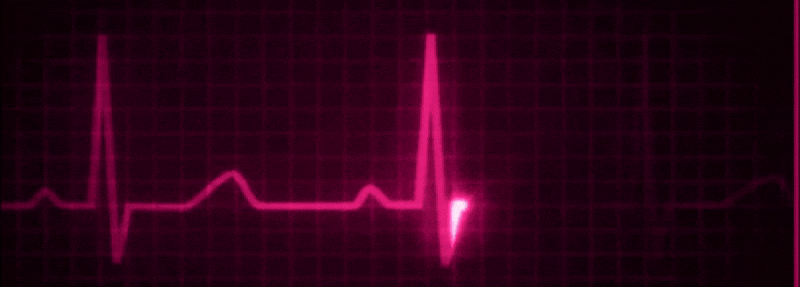

  

<h3 align="center">Medical Imaging AI</h3>

Deep Learning for Clinical Applications · Image Segmentation · Biosignal Analysis

---

### Hi, I'm Caitlin 👋

I specialise in **AI-driven medical imaging** — building deep learning pipelines for segmentation, classification, and clinical decision support across MRI, X-ray, and EEG modalities.

**Medical AI Intern @ Perfint Healthcare** — interventional oncology imaging platform  
**Research Intern @ Sudha Gopalakrishnan Brain Centre, IIT Madras** — foetal MRI segmentation, stroke MRI analysis  
**Research Intern @ Computational Neuroscience & Neural Engineering Lab, IIT Madras** — EEG deep learning  

---

### Core Expertise
🩻 **Medical Image Segmentation** — 3D U-Net, SegResNet, Attention U-Net (ISLES 2022, MONAI)  
🧠 **Neuroimaging** — NIfTI processing, FSL, ANTs, ITK-SNAP, 3D Slicer, NiftyMIC  
📡 **Biosignal Analysis** — EEG preprocessing, spectral features, MNE, PhysioNet datasets  
🔬 **Clinical AI Pipelines** — end-to-end DL from DICOM/NIfTI to inference, FastAPI deployment  

---

### Key Results
- Stroke lesion segmentation — Separate-Encoder U-Net, mean Dice **0.563** (ISLES 2022)
- Brain tumour detection — MobileNetV2, **90% accuracy**, **0.97 AUC**
- Pneumonia classifier — CNN deployed via FastAPI

---

📫 
